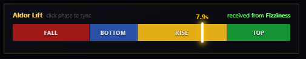
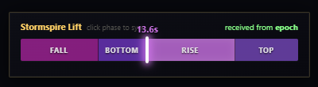
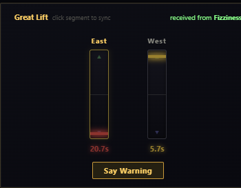
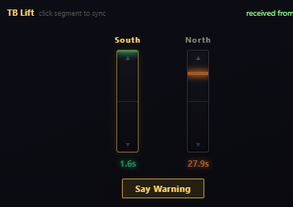
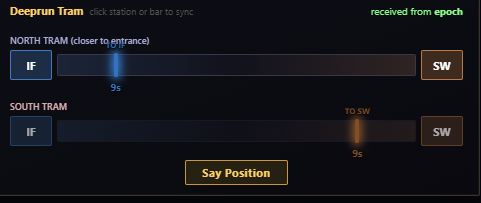
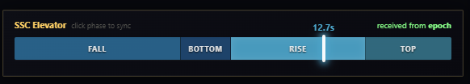

# AldorTax

Transport timing addon for WoW Classic Anniversary. Tracks lift and tram cycles so you don't fall off the Aldor Rise or miss the Deeprun Tram.

## Supported Transports

- **Aldor Lift** (Shattrath City) -- 25.0s cycle

- **Stormspire Lift** (Netherstorm) -- 25.0s cycle

- **Great Lift** (Thousand Needles / The Barrens) -- 30.0s cycle, dual platform

- **TB Lift** (Thunder Bluff) -- 30.0s cycle, dual platform

- **Deeprun Tram** (IF-SW) -- 143.0s cycle

- **SSC Elevator** (Serpentshrine Cavern) -- 43.3s cycle

The Great Lift is disabled on clients where it no longer exists (Cataclysm+).

## How It Works

Click a phase segment on the tracking bar when you see the transport reach that point. A 200ms reaction offset is applied automatically. Your sync is broadcast to nearby players via General/Guild and party/raid.

The UI shows a full panel when you're near the transport and a compact view when approaching. Click the X to dismiss; it reappears next time you enter the zone.

## Slash Commands

| Command | Action |
|---------|--------|
| `/atax config` | Open settings |
| `/atax ui` | Toggle the sync panel |
| `/atax log` | Show/hide the diagnostic log |

## Installation

1. Download from [CurseForge](https://www.curseforge.com/wow/addons/aldor-tax).
2. Extract `AldorTax` to `Interface\AddOns\`.
3. `/reload`

## Thank You

Thanks to the [Operasjon Firkløver](https://o4k.no/) gaming community for testing, to Sørlin for the window position persistence idea, and to Llethander for reporting the channel sync issue.

Developed by Fizziness.
